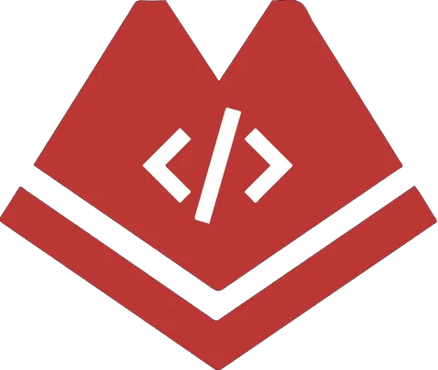
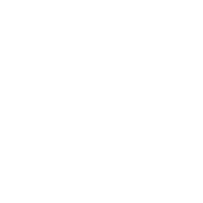

<p align="center">
  <picture>
    <source media="(prefers-color-scheme: dark)" srcset="./public/logos/sun-white.svg">
    
  </picture>
</p>

<h1 align="center">Aleph Hackathon Salta 2026</h1>

<p align="center">
  Guía del chapter local para anotarse, llegar preparado y entregar el proyecto.
</p>

<p align="center">
  <a href="https://astro.build/"></a>
  <a href="https://tailwindcss.com/"></a>
  <a href="https://www.typescriptlang.org/"></a>
  <a href="https://nodejs.org/"></a>
  <a href="https://www.npmjs.com/"></a>
</p>

<p align="center">
  <a href="https://alephhackathon.crecimiento.build/">Sitio oficial</a> ·
  <a href="https://x.com/alephhackathon">X</a> ·
  <a href="https://t.me/+sXWv0kpT7qo4ZTdk">Telegram</a>
</p>

## Qué es esta web

Este sitio reúne la información práctica del chapter de Salta de la [Aleph Hackathon](https://alephhackathon.crecimiento.build/), que se realiza el 22 y 23 de agosto de 2026.

La web permite consultar:

- cómo completar el apply oficial y reservar el cupo presencial;
- agenda, sede y cómo llegar a Vapadu HQ;
- setup, cuentas y herramientas necesarias;
- reglas del evento y preguntas frecuentes;
- cómo preparar y entregar el proyecto;
- una credencial para compartir en Instagram o X.

El sábado es presencial en Vapadu HQ, Deán Funes 462, Piso 5, Oficina 17, Salta. El domingo es online para hacking, submissions, judging y cierre.

## Aleph y sponsors del chapter

<p align="center">
  <a href="https://alephhackathon.crecimiento.build/">
    
  </a>
  &nbsp;&nbsp;
  <a href="https://salta.dev">
    
  </a>
  &nbsp;&nbsp;
  <a href="https://vapadu.ai">
    
  </a>
  &nbsp;&nbsp;
  <a href="https://desafia.tech/">
    
  </a>
  &nbsp;&nbsp;
  <a href="https://www.instagram.com/sorbolabs/">
    
  </a>
  &nbsp;&nbsp;
  <a href="https://web3.bitget.com/">
    
  </a>
</p>

El chapter está co-organizado por [SaltaDev](https://salta.dev), [Vapadu](https://vapadu.ai), [DESAFIA](https://desafia.tech/), [Sorbo Labs](https://www.instagram.com/sorbolabs/) y [Bitget Wallet](https://web3.bitget.com/). Vapadu también es la sede del encuentro presencial.

## Tecnologías

- [Astro](https://astro.build/) para generar el sitio estático.
- [Tailwind CSS](https://tailwindcss.com/) 4 integrado mediante `@tailwindcss/vite`.
- TypeScript para el contenido, la lógica de interacción y el generador de credenciales.
- CSS propio para el sistema visual, responsive design y accesibilidad.
- APIs nativas del navegador para diálogos, checklist local, countdown, compartir y generación de imágenes.

## Levantar el proyecto

### Requisitos

- Node.js `>=22.12.0`
- npm `>=10`

### Desarrollo local

```bash
npm ci
npm run dev
```

Abrí la URL que muestra Astro, normalmente [`http://localhost:4321`](http://localhost:4321).

### Build y preview

```bash
npm run build
npm run preview
```

`npm run build` genera el sitio listo para producción en `dist/`.

## Deploy en Vercel

1. Importá el repositorio `facundopadilla/aleph-hackathon-2026-salta`.
2. Elegí Astro como framework preset.
3. Usá `npm run build` como build command.
4. Usá `dist` como output directory.

El proyecto es estático y no necesita un adapter de Astro ni variables de entorno.

## Estructura del proyecto

```text
.
├── public/
│   ├── fonts/             # Geist y assets tipográficos
│   └── logos/             # Aleph y logos de sponsors
├── src/
│   ├── components/        # Navegación, secciones y componentes UI
│   ├── content/site.ts    # Copy, agenda, datos del evento y links
│   ├── layouts/           # Layout base y metadata
│   ├── lib/               # Lógica del generador de credenciales
│   ├── pages/             # Rutas Astro
│   └── styles/            # CSS global y tokens visuales
├── DESIGN.md              # Sistema visual y decisiones de diseño
├── PRODUCT.md             # Propósito, usuarios y criterios del producto
└── package.json           # Scripts y dependencias
```

Para cambiar textos o links del evento, editá [`src/content/site.ts`](src/content/site.ts). El CTA de WhatsApp aparece solo cuando se completa `links.whatsapp`.

## Links oficiales

### Aleph Hackathon

- [Sitio oficial](https://alephhackathon.crecimiento.build/)
- [X / Twitter](https://x.com/alephhackathon)
- [Telegram](https://t.me/+sXWv0kpT7qo4ZTdk)
- [Notion](https://alephhackathon.notion.site)
- [DoraHacks](https://dorahacks.io/org/alephhackathon)

### Crecimiento

- [Sitio web](https://crecimiento.build/)
- [Instagram](https://www.instagram.com/crecimientoar/)
- [LinkedIn](https://www.linkedin.com/company/crecimientobuild)

### Sponsors

- [SaltaDev](https://salta.dev) · [Instagram](https://instagram.com/salta.dev) · [LinkedIn](https://salta.dev/linkedin) · [Discord](https://salta.dev/discord/) · [GitHub](https://salta.dev/github/) · [X](https://salta.dev/x/)
- [Vapadu](https://vapadu.ai) · [Instagram](https://www.instagram.com/vapadu.ia/) · [LinkedIn](https://www.linkedin.com/company/vapad%C3%BA) · [Facebook](https://www.facebook.com/vapadu)
- [DESAFIA](https://desafia.tech/) · [Instagram](https://www.instagram.com/desafia.tech) · [X](https://x.com/desafiatech)
- [Sorbo Labs](https://www.instagram.com/sorbolabs/)
- [Bitget Wallet](https://web3.bitget.com/) · [Instagram](https://www.instagram.com/bitgetwallet.esp/) · [X](https://x.com/BitgetWalletES)
